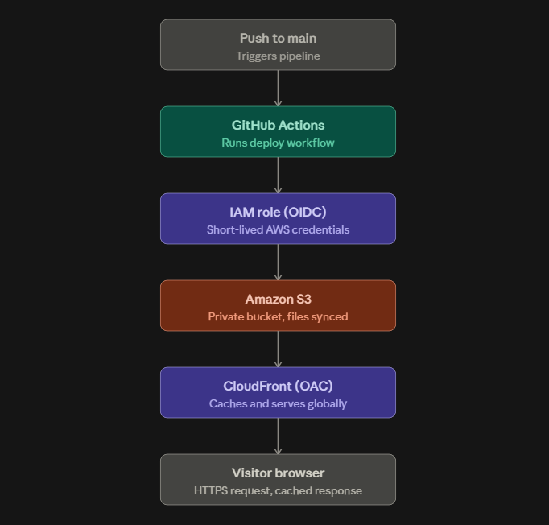
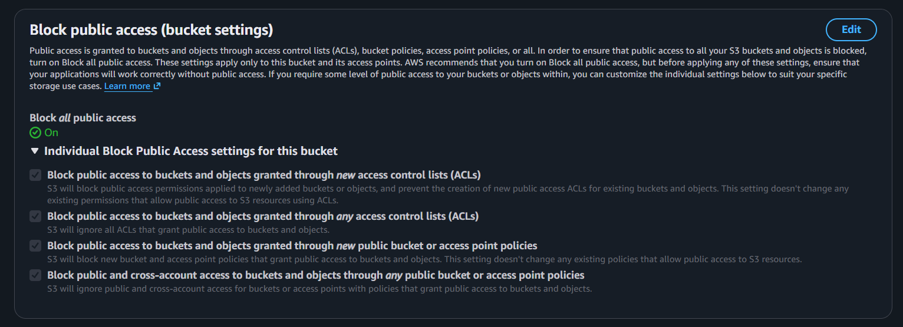
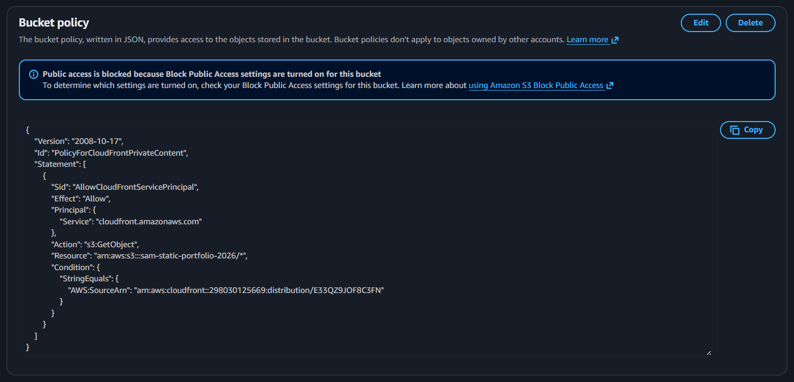
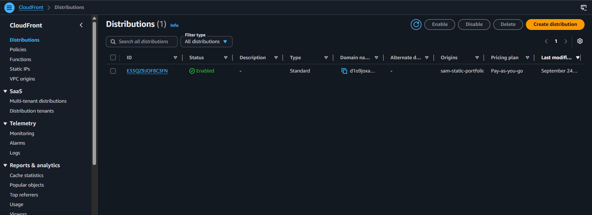
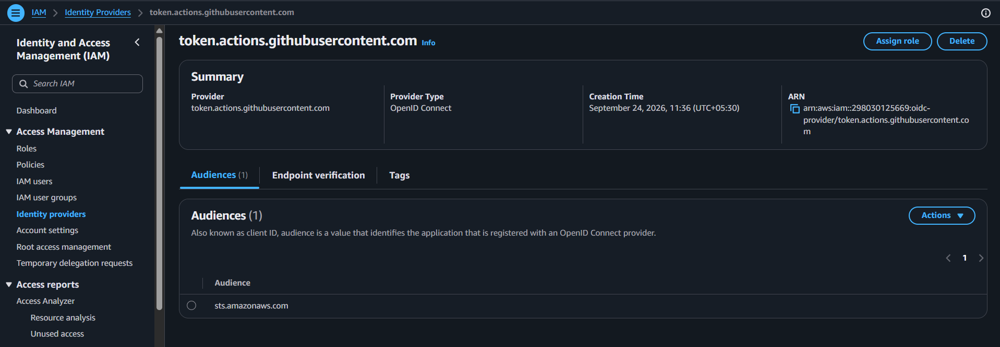
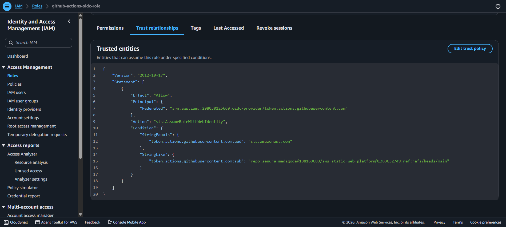
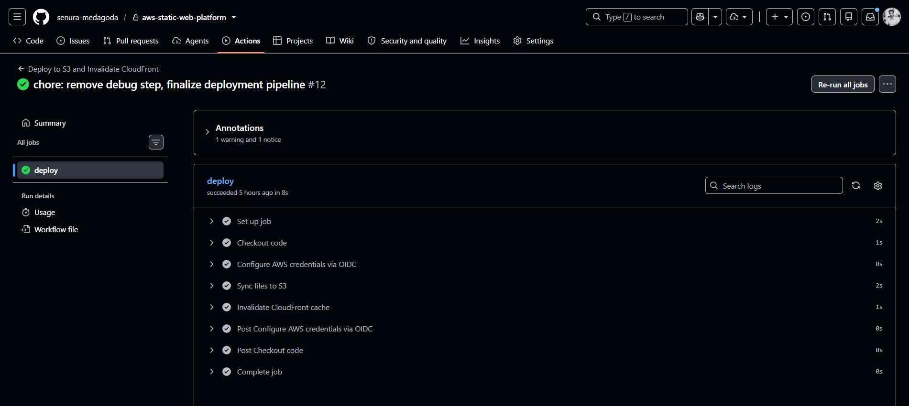
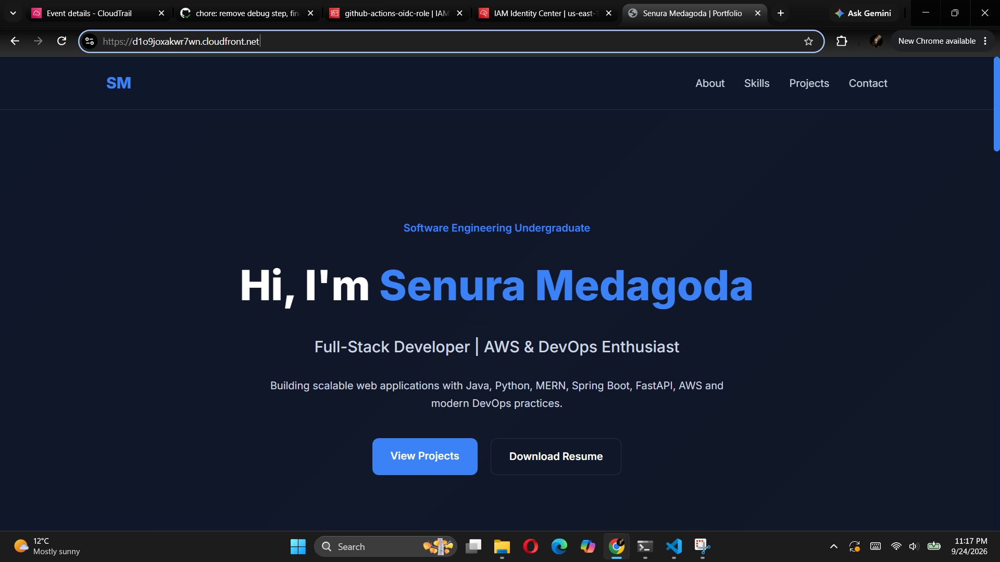

# AWS Static Portfolio Site with Secure CI/CD Pipeline

A globally-distributed static website hosted on AWS, deployed through a fully automated CI/CD pipeline authenticated via OIDC federation (no long-lived AWS credentials stored anywhere).

## Live Site

[https://d1o9joxakwr7wn.cloudfront.net/]

## Architecture

**Flow:** Push to `main` → GitHub Actions authenticates to AWS via OIDC (no stored secrets) → syncs files to a private S3 bucket → invalidates the CloudFront cache → changes go live globally within minutes.

## Why this architecture

| Component | Purpose | Why chosen over the alternative |
|---|---|---|
| **Amazon S3** | Stores the static site files | No server to provision, patch, or pay for idle — object storage is the correct primitive for files that don't change based on server-side logic |
| **CloudFront (CDN)** | Serves the site globally, adds HTTPS | S3 alone only serves plain HTTP and is slow for visitors far from its region; CloudFront caches at edge locations worldwide and terminates HTTPS |
| **Origin Access Control (OAC)** | Restricts S3 access to only this CloudFront distribution | Keeps the bucket 100% private — avoids the common anti-pattern of making the bucket public, which would let anyone bypass CloudFront and read files directly |
| **GitHub Actions** | Automates deployment on every push | Removes manual upload steps entirely; deployment becomes reproducible and auditable via commit history |
| **OIDC Federation (vs. IAM access keys)** | Authenticates the pipeline to AWS | Issues short-lived, per-run credentials instead of storing a permanent Access Key/Secret in GitHub — eliminates a whole class of credential-leak risk |
| **Least-privilege IAM policy** | Scopes the pipeline's permissions | The deploy role can only `PutObject`/`DeleteObject`/`ListBucket` on this one bucket and `CreateInvalidation` on CloudFront — nothing else, limiting blast radius if anything is ever compromised |

## Security decisions

- S3 bucket has **all public access blocked** — the bucket is never directly reachable; every request must go through CloudFront.
- CloudFront reaches the bucket only via a signed OAC request, verified against the bucket policy shown below.
- The IAM role assumable by GitHub Actions is restricted via trust-policy condition to this exact repository (`repo:<your-username>/aws-static-portfolio-cicd:*`) — no other GitHub repo, even under the same account, can assume it.
- MFA is enabled on the IAM user managing this account.

## Evidence

**S3 bucket — public access fully blocked**

**S3 bucket policy (OAC-restricted)**

**CloudFront distribution — Enabled and serving traffic**

**IAM OIDC identity provider registered**

**IAM role trust policy — scoped to this repo only**

**GitHub Actions — successful automated deployment**

**Live site — HTTPS padlock visible**

## How the pipeline works

1. Any push to `main` triggers `.github/workflows/deploy.yml`.
2. The workflow requests a short-lived OIDC token from GitHub and exchanges it with AWS STS for temporary credentials scoped to a single IAM role.
3. `aws s3 sync` uploads only the changed files to the S3 bucket.
4. `aws cloudfront create-invalidation` clears the CDN cache so the new version is served immediately instead of a stale cached copy.

## Tech stack

`AWS S3` · `AWS CloudFront` · `AWS IAM (OIDC Federation)` · `GitHub Actions` · `HTML/CSS`

## What I'd improve with more time

- Add a staging environment (separate bucket/distribution) to test changes before they hit the production CloudFront distribution.
- Add AWS WAF for bot/attack filtering if this were handling real production traffic.
- Add automated Lighthouse/performance checks as a pipeline step before deploy.

## Reproducing this project

1. Create an S3 bucket with all public access blocked.
2. Create a CloudFront distribution with Origin Access Control pointed at that bucket, and apply the generated bucket policy.
3. Register GitHub as an OIDC identity provider in IAM and create a role trusted only by your specific repo.
4. Add `.github/workflows/deploy.yml` from this repo, updating the bucket name, distribution ID, and role ARN.
5. Push to `main`.